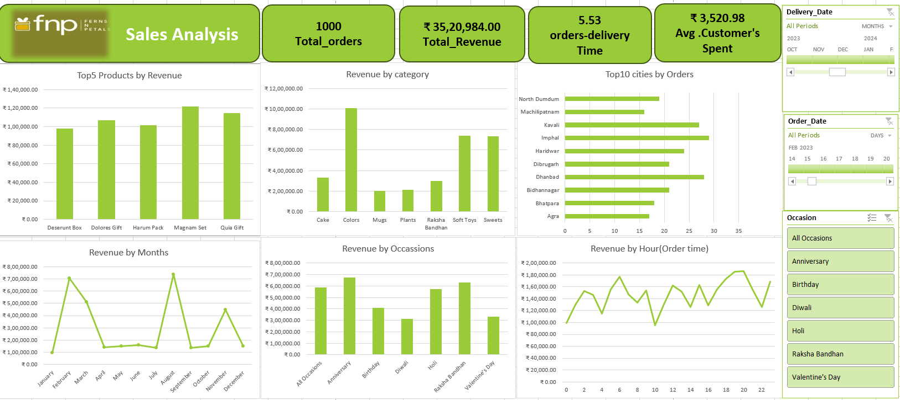

# 📊 FNP Sales Analysis Dashboard

## Executive Summary

The **FNP Sales Analysis Dashboard** is an interactive business intelligence project developed in **Microsoft Excel** to analyze sales performance and uncover actionable insights from FNP's sales data. The dashboard consolidates key business metrics into a single, user-friendly interface, enabling stakeholders to monitor revenue, customer behavior, product performance, delivery efficiency, and seasonal sales trends.

The project leverages **Power Query** for data cleaning and transformation, **Power Pivot** for data modeling, **DAX Measures** for KPI calculations, and **Pivot Tables & Pivot Charts** for interactive visualizations. Slicers and Timelines allow users to dynamically filter the dashboard by **Order Date**, **Delivery Date**, and **Occasion**.

The dashboard tracks the following KPIs:

- 📦 Total Orders: **1,000**
- 💰 Total Revenue: **₹35,20,984**
- 👤 Average Customer Spend: **₹3,520.98**
- 🚚 Average Delivery Time: **5.53 Days**

The dashboard also provides insights into:

- Top 5 Products by Revenue
- Revenue by Product Category
- Top 10 Cities by Orders
- Monthly Revenue Trends
- Occasion-wise Revenue Analysis
- Revenue by Order Time
- Interactive Filtering using Slicers and Timelines

This project demonstrates the practical use of Microsoft Excel for Business Intelligence by transforming raw sales data into meaningful visual reports that support data-driven decision-making.

---

## Dashboard Preview

---

## Business Objective

The objective of this project is to analyze sales performance and answer key business questions such as:

- What is the total revenue generated?
- Which products generate the highest revenue?
- Which product categories perform the best?
- Which cities receive the highest number of orders?
- How does revenue vary across months?
- Which occasions contribute the most to sales?
- What are customer purchasing patterns throughout the day?
- What is the average delivery time?
- How much does an average customer spend?

---

## Tools & Technologies

- Microsoft Excel
- Power Query
- Power Pivot
- DAX
- Pivot Tables
- Pivot Charts
- Slicers
- Timelines
- Data Visualization

---

## Key Features

- Interactive Dashboard
- Dynamic Filters
- KPI Cards
- Sales Trend Analysis
- Customer Spending Analysis
- Product Performance Analysis
- Occasion-wise Revenue Analysis
- City-wise Order Analysis
- Delivery Performance Analysis

---

## Key Insights

- Generated revenue of **₹35.2 Lakhs** from **1,000 orders**.
- Colors, Soft Toys, and Sweets contributed significantly to revenue.
- Customer demand varied across different occasions and months.
- Revenue peaked during seasonal events and festivals.
- Average customer spending was **₹3,520.98**.
- Average delivery time was **5.53 days**.

---

## Project Outcome

This dashboard helps business stakeholders monitor sales performance, identify revenue opportunities, understand customer purchasing behavior, and make data-driven business decisions.

---

Skills:
- Excel
- SQL
- Power BI
- Python
- Data Analysis
